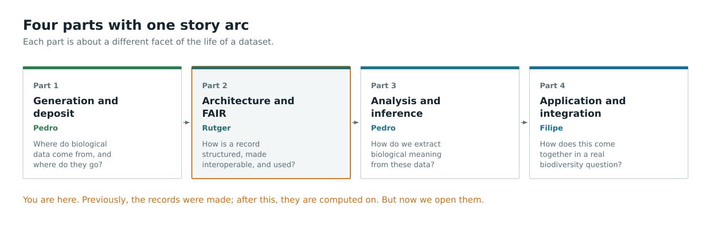
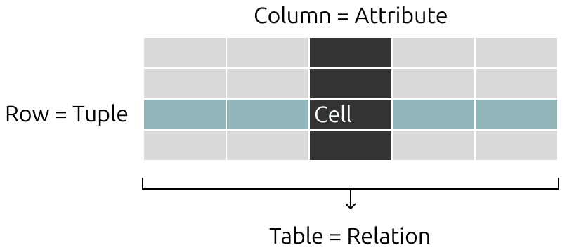
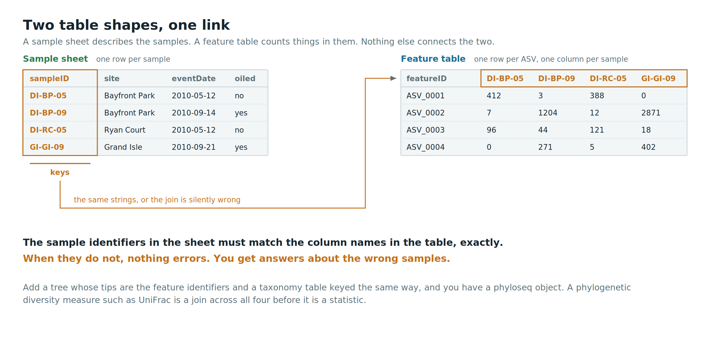
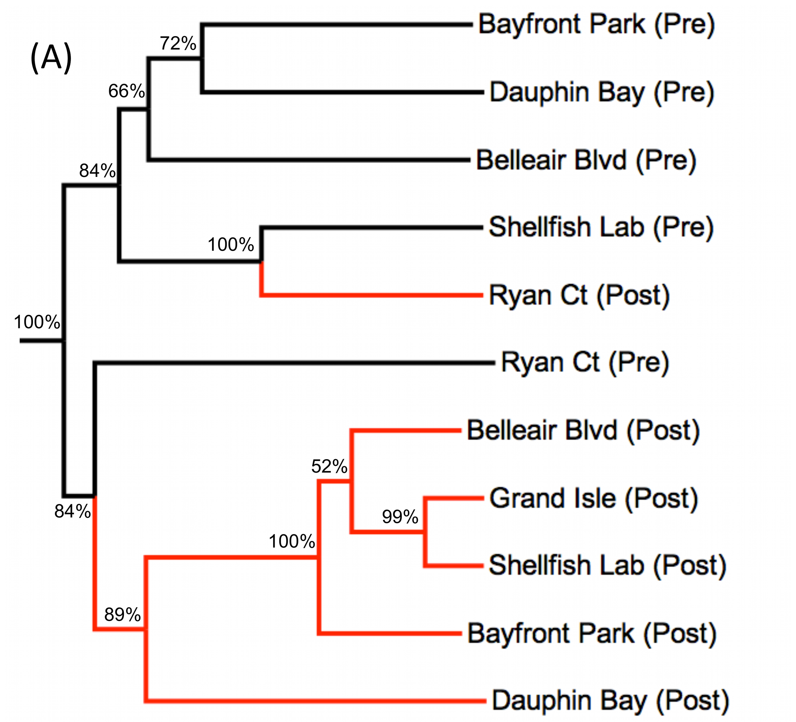
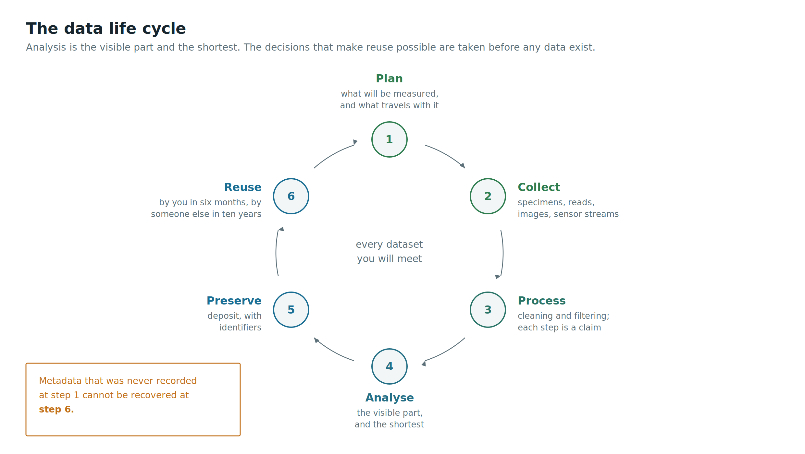
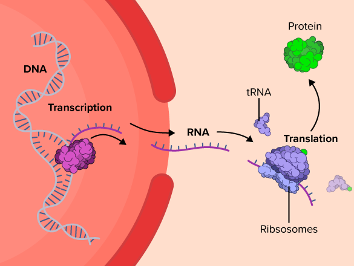
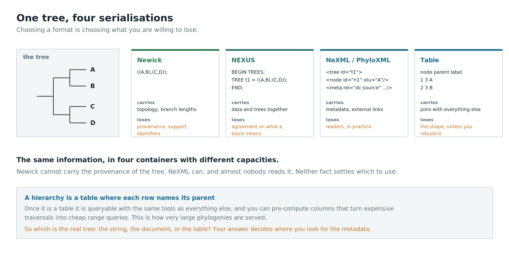

The anatomy of a biological record
==================================

Where we are
------------



DABDGE follows a story arc, and we are now at the second stop:

- **Part 1** - Data generation and deposit. Where do biological data come from, and where do they go?
- **Part 2** - Data architecture and FAIR. **How is a biological record structured, made interoperable,
  and used?**
- **Part 3** - Data analysis and inference. How do we extract biological meaning from data?
- **Part 4** - Data application and integration. How does it all come together in a real biodiversity
  question?

Previously, you saw how sequences, occurrences and measurements are produced, and you 
learned to read a CSV into R and package your work as R Markdown or Quarto. Now we open 
the records themselves. Next week you will compute on them.

> By the end of tomorrow you should be able to take any biological record you meet for 
> the rest of the master's and answer four questions about it: what identifies it, what 
> it asserts, who asserted it, and what it can be joined to.

A case to open with
-------------------


A 2012 study of shifts in benthic microbial eukaryote communities caused by the Deepwater
Horizon oil spill in the Gulf of Mexico deposited its data in three places at once:

- **Dryad**, under a DOI
- **MG-RAST**, under a submission ID
- **NCBI SRA**, under an accession number

So there are three depositions, each with its own identifier type, at different 
granularities, under different curation regimes, for a single study.

> Why three? What does each deposit make possible that the others do not? And which of 
> the three would you go to if you wanted to re-run the analysis?

We will go into this in the afternoon lecture, after we have the words to talk about this.

(**HM Bik, KM Halanych, J Sharma & WK Thomas**, 2012. Dramatic shifts in benthic microbial eukaryote
communities following the Deepwater Horizon oil spill. _PLoS ONE_ **7**(6): e38550.
doi:[10.1371/journal.pone.0038550](https://doi.org/10.1371/journal.pone.0038550))

What is a record?
-----------------

Whatever the database, a biological record has the same four parts:

1. **An identifier** - a string that picks out this record and no other, within some scope
2. **Content** - the thing being recorded: a sequence, a count, a coordinate, a mass spectrum
3. **Metadata** - what was measured, where, when, by whom, with what, under what conditions
4. **Provenance** - who asserted all of the above, when, and on what basis

Biology students tend to see the content as the record and the rest as paperwork. For the purposes
of analysis, the opposite is closer to the truth: **the content is usually the least informative
part**. A sequence of A, C, G and T tells you nothing until you know what organism it came from,
which marker it represents, and who decided so.

> Take any figure from a paper you have read recently. Which part of it comes from 
> content, and which part comes from metadata?

Rows, columns, identifiers
--------------------------



Nearly all biological data end up in tables, and nearly all confusion about biological data comes
from not knowing what a row is.

- A **row** is one observation of one thing
- A **column** is one variable measured on every thing
- One column is (or should be) the **key**: the identifier that other tables can point at

This is the "[tidy data](https://www.jstatsoft.org/article/view/v059i10)" convention. It 
is worth being pedantic about it, because every join you perform for the rest of this 
master's depends on the key columns meaning what you think they mean.

```
occurrenceID          scientificName        eventDate    decimalLatitude  decimalLongitude
URN:catalog:XX:1234   Cladosporium sp.      2010-05-12   30.2481          -88.0759
URN:catalog:XX:1235   Enoploides sp.        2010-05-12   30.2481          -88.0759
```

> In that fragment, what is the thing that each row is one of? A specimen? An observation? 
> A sequence? The column names tell you, and they were chosen from a standard vocabulary 
> so that they could.

Sample sheets versus feature tables
-----------------------------------



Two shapes recur across many data types you will meet:

- A **sample sheet**: one row per sample, columns are properties of the sample (site, date, depth,
  treatment, oiling status)
- A **feature table**: one row per feature (gene, OTU, ASV, protein, taxon), one column per sample,
  cells are abundances or presences

They are not interchangeable, and they are linked by exactly one thing: the sample identifiers in the
sample sheet must match the column names in the feature table. When they do not, nothing errors. You
simply get answers about the wrong samples.

The join is the analysis
------------------------



Consider a phylogenetically informed beta diversity measure such as UniFrac. To compute it, you need
three objects:

1. A **feature table**: abundances of each OTU or ASV in each sample
2. A **sample sheet**: what each sample is
3. A **tree** whose tips are the feature identifiers

In R, `phyloseq` bundles exactly these (plus a taxonomy table) into one object, and refuses to build
it if the identifiers do not line up. That refusal is a feature.

> The ecological question ("are these communities different?") cannot be asked until a 
> relational question ("do these three objects share a key?") has been answered. Beta 
> diversity is a join before it is a statistic.

You might do this for real at a later point in your studies. Today the point is 
structural: analyses are operations over several linked tables, and the links are made of 
identifiers.

The data life cycle
-------------------



- **Plan** - what will be measured, and what metadata will be captured alongside it
- **Collect** - specimens, reads, images, sensor streams
- **Process** - cleaning, filtering, transformation. Each step is a claim
- **Analyse** - the visible part, and usually the shortest
- **Preserve** - deposit, with identifiers
- **Reuse** - by you in six months, by someone else in ten years

Two observations. First, the analysis step is a small slice of the cycle but takes nearly all the
attention. Second, decisions made in the first step determine whether the last step is possible at
all. Metadata that was never recorded cannot be recovered later.

The central dogma as a data pipeline
------------------------------------



Every step of the central dogma has a file format attached to it, and the formats are how the
biology moves between programs.

| Step | Object | Typical format |
| ---- | ------ | -------------- |
| Genome | assembled reference | FASTA |
| Sequencing | raw reads with quality | FASTQ |
| Mapping | reads placed on a reference | SAM / BAM / CRAM |
| Variation | differences from a reference | VCF |
| Annotation | features at coordinates | GFF / GTF |
| Gene record | sequence plus its metadata | GenBank flat file |
| Protein | sequence plus function | FASTA, UniProt entry |
| Mass spectrometry | spectra | mzML |

The point is not to memorise the list. It is that **a format is a contract about what metadata
travels with the data**, and formats differ mainly in how much context they carry.

The FASTA format
----------------

The minimal format. A definition line starting with `>`, then sequence.

```
>BOLD:AANIC001-10|Danaus plexippus|COI-5P|GU706282
AACATTATATTTTATTTTTGGAATTTGAGCAGGAATAGTAGGAACTTCTTTAAGATTATTAATTCGAACAGAATTA...
```

Notice what just happened. FASTA has no metadata fields, so people invented a convention 
of stuffing pipe-delimited metadata into the definition line. Every database does this 
differently. Every downstream script must therefore parse the definition line, and every 
such parser is a small, fragile, undocumented standard.

> This is the cheapest possible illustration of what standards are for. When a format has 
> no place to put the metadata, the metadata does not disappear. It goes somewhere worse.

The FASTQ format
----------------

FASTA plus per-base quality, in four lines per read:

```
@SRR050276.1 length=250
TACGGAGGATGCGAGCGTTATCCGGATTTATTGGGTTTAAAGGGAGCGTAGG
+
CCCFFFFFHHHHHJJJJJJJJJJJJJJJJJJJJJJJJJJJJJJJJHHHFFFD
```

- Line 1: identifier, after `@`
- Line 2: the bases
- Line 3: `+`, optionally repeating the identifier
- Line 4: one quality character per base

The quality characters encode **phred scores**: Q = -10 log10(P), where P is the probability that the
base call is wrong. Q20 is one error in 100, Q30 one in 1000.

Which ASCII offset is used to encode those numbers has varied between platforms and eras, which is
why you will occasionally meet a FASTQ file that appears to have impossibly good or impossibly bad
quality. The bytes are fine. The interpretation is missing.

> Quality scores are metadata about content, stored in the same file, in a format that needs
> external knowledge to decode. How would you record which encoding was used?

The GenBank flat file
---------------------

The opposite extreme from FASTA: a record that carries its own metadata, in named fields.

```
LOCUS       GU706282                 658 bp    DNA     linear   INV 01-JAN-2011
DEFINITION  Danaus plexippus voucher BIOUG:... cytochrome oxidase subunit 1 gene.
ACCESSION   GU706282
VERSION     GU706282.1
SOURCE      Danaus plexippus
  ORGANISM  Danaus plexippus
            Eukaryota; Metazoa; Ecdysozoa; Arthropoda; ...
FEATURES             Location/Qualifiers
     source          1..658
                     /organism="Danaus plexippus"
                     /specimen_voucher="BIOUG:..."
                     /country="Canada"
                     /lat_lon="44.36 N 78.02 W"
     CDS             1..658
                     /gene="COI"
                     /codon_start=1
                     /product="cytochrome oxidase subunit 1"
ORIGIN
        1 aacattatat tttatttttg gaatttgagc aggaatagta ggaacttctt taagattatt
```

Fetch one yourself:

```bash
curl "https://eutils.ncbi.nlm.nih.gov/entrez/eutils/efetch.fcgi?db=nuccore&id=GU706282&rettype=gb&retmode=text"
```

> Which fields in that record are controlled (only certain values allowed), and which are free text?
> What happens to a search that relies on a free text field?

GFF: annotation as coordinates
------------------------------

An annotation is not a property of a sequence. It is a claim about a **span of coordinates on a
named reference**, and it is meaningless without that reference.

```
##gff-version 3
C09  NCBI  gene  12459  14320  .  +  .  ID=gene:BolC9t12345;Name=FT
C09  NCBI  mRNA  12459  14320  .  +  .  ID=transcript:BolC9t12345.1;Parent=gene:BolC9t12345
C09  NCBI  CDS   12580  13011  .  +  0  Parent=transcript:BolC9t12345.1
```

Change the reference assembly and every coordinate in the file is wrong, silently. This is the same
lesson as the sample sheet: the data are fine, the link has broken.

Orientation only
----------------

You will likely meet these at some point in your career, but you do not need them this week.

- **SAM / BAM / CRAM** - reads aligned to a reference, with a CIGAR string describing how each read
  matches and bitwise flags describing its status
- **VCF / BCF** - positions where samples differ from a reference, with genotype calls per sample
- **BED** - the minimal interval format: reference, start, end

Depth on alignment and variant calling is handed off to **CU2 Fundamentals of Computational Biology**
and **CU4 Omics and Genetic Approaches in Model Organisms**.

What an accession promises
--------------------------

An accession is not a name. It is a **commitment by an institution** that a particular 
string will continue to resolve to a particular record.

The International Nucleotide Sequence Database Collaboration (INSDC) ties NCBI GenBank, the European
Nucleotide Archive and DDBJ together: submit to one and the record appears in the others, with the
same accession. That is an unusually strong promise, and it is rare.

| Resource | Example | What it identifies |
| -------- | ------- | ------------------ |
| GenBank / ENA | `GU706282` | one submitted sequence |
| RefSeq | `NC_045512` | a curated reference sequence |
| SRA | `SRR050276` | one sequencing run |
| UniProtKB | `P12345` | one protein entry |
| GBIF | `gbifID` plus a dataset UUID | one occurrence, in one dataset |
| BOLD | `AANIC001-10` | one specimen record |
| BOLD BIN | `BOLD:AAA1234` | a cluster of similar barcodes |
| DOI | `10.5061/dryad.4sd51d4b` | a citable deposit, at whatever granularity was deposited |

> Which of these identify a physical object, which identify a digital object, and which identify an
> inference? The BIN is the interesting case, and you will meet it again in week 4.

Records change
--------------

`GU706282.1` and `GU706282.2` are the same record at different times. Sequence corrections,
re-identifications and taxonomic revisions all produce new versions.

- Cite the **versioned** accession when the exact content matters, which in a methods section it
  always does
- Expect the **taxonomy** attached to a sequence to be less stable than the sequence itself
- UniProt goes further and distinguishes reviewed entries (Swiss-Prot, manually curated) from
  unreviewed ones (TrEMBL, automatically annotated). The accession does not tell you which; the entry
  does

> A paper says "sequences were downloaded from GenBank in March 2019". Can you reproduce that
> download today? What would the authors have had to write instead?

Submission: the other direction
-------------------------------

Everything above exists because somebody submitted it. When you submit, you are asked for exactly the
metadata that you were annoyed to find missing when you were downloading:

- what the organism is, and on what basis it was identified
- where and when it was collected, and by whom
- what was done to it in the lab, and with which primers or platform
- which project or study it belongs to

Submission is also where the identifiers are minted, which is the moment your data become citable
rather than merely available.

Same information, many serialisations
-------------------------------------



Take a phylogeny. All of these encode the same tree:

```
((A,B)n1,(C,D)n2)n3;
```

- **Newick** - compact, ubiquitous, and carries almost nothing besides topology and branch lengths
- **NEXUS** - blocks for data, trees and commands; extensible by convention, which means
  incompatibly
- **PhyloXML**, **NeXML** - schema-validated XML, with room for annotations, metadata and links to
  external identifiers
- **Tabular** - parent and child columns in a relational table or a database

Each is lossless for some purposes and lossy for others. Newick cannot carry the provenance of the
tree; NeXML can, and almost nobody reads it. The lesson is not that one format wins. It is that
**choosing a format is choosing what you are willing to lose**.

A hierarchy in a table
----------------------

Trees are not special. A tree is a table where each row names its parent:

```
node_id  parent_id  label   branch_length
1        3          A       0.1
2        3          B       0.2
3        5          n1       0.05
```

Once it is a table, it is queryable with the same tools as everything else, and you can pre-compute
columns (such as the left and right indices of a nested set) that turn expensive tree traversals into
cheap range queries. This is how very large phylogenies are served.

> Which is the "real" tree: the Newick string, the XML document, or the table? The question is not
> rhetorical. Your answer determines where you look for the metadata.

Where this leaves us
--------------------

- A record is an identifier, content, metadata and provenance
- Analyses are joins across linked tables, and the joins are made of identifiers
- Formats differ mainly in how much context they carry
- An accession is an institutional promise, with a version
- Serialisation is a choice about what to discard

This afternoon we take these records out into the world, where they were made by different
communities using different vocabularies, and ask what it takes to put them together.

Reading
-------

- **MD Wilkinson et al.**, 2016. The FAIR Guiding Principles for scientific data management and
  stewardship. _Scientific Data_ **3**: 160018.
  doi:[10.1038/sdata.2016.18](https://doi.org/10.1038/sdata.2016.18)
- **H Wickham**, 2014. Tidy Data. _Journal of Statistical Software_ **59**(10).
  doi:[10.18637/jss.v059.i10](https://doi.org/10.18637/jss.v059.i10)
- **V Buffalo**, 2015. _Bioinformatics Data Skills_. O'Reilly. Chapters on data formats and on
  reproducibility.
