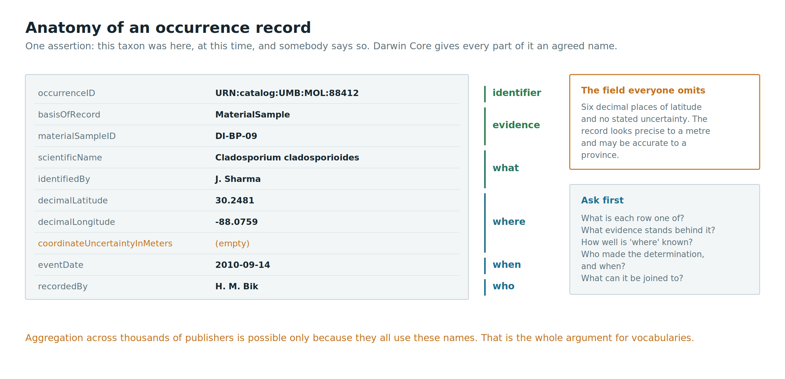
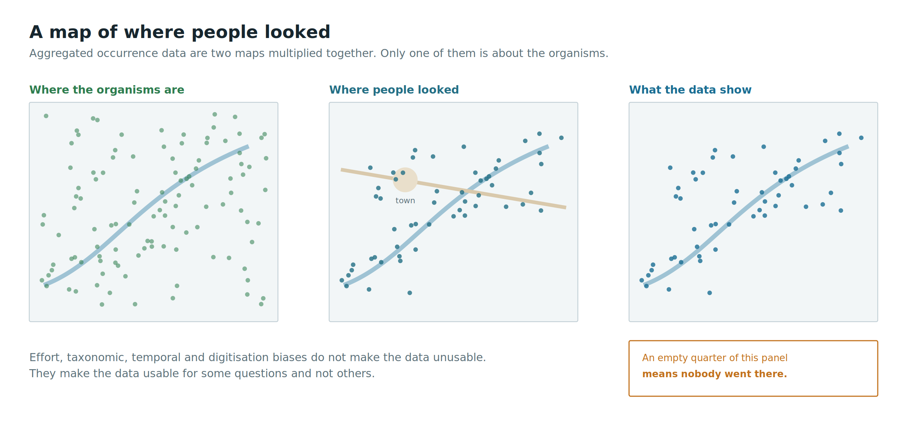
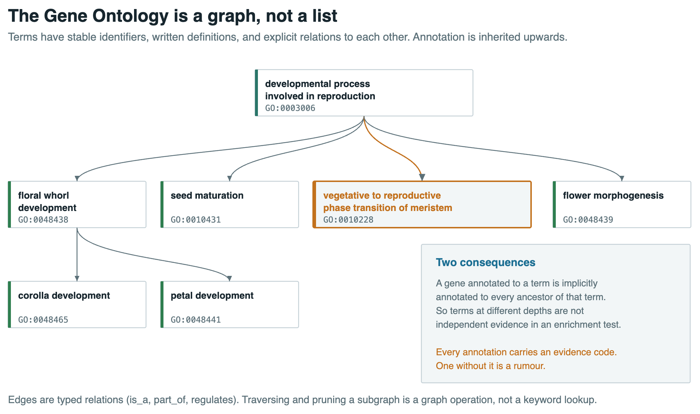

From record to network
======================

Where we left off
-----------------

This morning we opened a single record: identifier, content, metadata, provenance. We saw that
analyses are joins, and that joins are made of identifiers.

Now the harder half. Records are made by different communities, in different formats, using
different words for the same thing, and curated to different standards. This afternoon is about what
it takes to put them together, and about what you are entitled to conclude once you have.

> **How is a biological record structured, made interoperable, and used?** We have done structured.
> Now interoperable and used.

Occurrence data
---------------



An occurrence is the simplest assertion in biodiversity science: **this taxon was here, at this
time, and somebody says so**.

[GBIF](https://www.gbif.org/) aggregates roughly that assertion from museums, herbaria, monitoring
programmes, citizen science platforms and sequence-derived datasets. [OBIS](https://obis.org/) does
the same for marine data. What makes aggregation possible at all is that everyone publishes in the
same vocabulary.

Darwin Core
-----------

[Darwin Core](https://dwc.tdwg.org/) is a set of agreed terms for biodiversity records. Not a file
format: a vocabulary, usually delivered as a Darwin Core Archive (a zipped set of tables plus a
metadata file describing them).

| Term | What it holds |
| ---- | ------------- |
| `occurrenceID` | stable identifier for this occurrence |
| `basisOfRecord` | specimen, observation, machine observation, material sample |
| `scientificName` | the name as given |
| `eventDate` | when, in ISO 8601 |
| `decimalLatitude`, `decimalLongitude` | where, in decimal degrees on a stated datum |
| `coordinateUncertaintyInMeters` | how well "where" is known |
| `recordedBy`, `identifiedBy` | who observed, who determined |
| `materialSampleID` | link to a physical sample |

Two of these deserve attention. `basisOfRecord` tells you what kind of evidence stands behind the
record, which is the first thing you should ask of any dataset. And
`coordinateUncertaintyInMeters` is the field that everyone omits, which means that a great many
occurrences with six decimal places of latitude are in fact accurate to a province.

> Open a record on GBIF. How many of the terms above are populated? Which absences would stop you
> from using it?

Where occurrence data come from, and what that does to them
-----------------------------------------------------------



Aggregated occurrence data are a map of where people have looked, overlaid on a map of where
organisms are. The two are not the same map.

- **Effort bias** - roads, universities, reserves, the coast, weekends
- **Taxonomic bias** - birds and butterflies against nematodes and fungi
- **Temporal bias** - expedition eras, monitoring programmes starting and stopping
- **Digitisation bias** - which collections have been databased, and which drawers within them

None of this makes the data unusable. It makes the data usable for some questions and not others.
This is the same competence you practised on experimental design last week, applied to data you did
not collect.

Programmatic access
-------------------

Every resource we use today has an API, which means every retrieval you do by clicking can be done
reproducibly instead.

```bash
# GBIF: occurrences of a genus, as JSON
curl "https://api.gbif.org/v1/occurrence/search?q=Cladosporium&limit=20"

# UniProt: one protein entry, as plain text
curl "https://rest.uniprot.org/uniprotkb/P12345.txt"

# NCBI: one nucleotide record, as GenBank
curl "https://eutils.ncbi.nlm.nih.gov/entrez/eutils/efetch.fcgi?db=nuccore&id=GU706282&rettype=gb&retmode=text"
```

A retrieval you can paste into a methods section is a retrieval somebody else can repeat. A sequence
of clicks is not.

> Which of your last five "I downloaded the data from X" moments could you reconstruct exactly
> today?

BOLD: three record types in one
-------------------------------

[BOLD](https://portal.boldsystems.org/) is worth looking at structurally, because a single BOLD record
binds together things that live in separate databases everywhere else:

- **specimen** data: voucher, collector, locality, coordinates, images
- **taxonomy**: the identification, and who made it
- **genetic** data: sequences, the marker, the primers, the trace files

```r
library(BOLDconnectR)

# public ids from BOLD v5
bold_ids <- bold.public.search(taxonomy = list("Danaus"))
head(bold_ids)

# full BCDM records for selected ids (with API key configured via bold.apikey())
bold <- bold.fetch(get_by = "processid",
                   identifiers = head(bold_ids$processid, 200))
head(dplyr::select(bold, processid, marker_code, insdc_acs, genus, species))
```

In BOLD v5, raw downloads are in BCDM tables (JSON/TSV), not FASTA. For the FASTA defline exercise in
TP2.1 we therefore use an archived v3-era file as a teaching artefact:

```bash
grep '>' Danaus.fas | cut -f 3 -d '|' | sort | uniq
```

That tells you which markers are present. It also breaks as soon as you need the sequences
themselves, because FASTA records span an unpredictable number of lines. Tomorrow morning you will
reach for Biopython at exactly that point.

**Scope note.** We are looking at BOLD's structure and retrieval plumbing only (now through
BOLDconnectR on the v5 API). Its content, the BIN concept, curation with BAGS and the analysis tools
are Filipe's territory in week 4, and they are the substance of your final integrative report.

A name is not an identifier
---------------------------

`Cladosporium cladosporioides` is a hypothesis, expressed in Latin, that may have been revised twice
since the record was written.

- The same organism appears under different names in different datasets (synonyms)
- The same name refers to different organisms in different groups (homonyms)
- Spelling, authorship and rank conventions vary
- Taxonomies disagree with each other, legitimately

So a join on `scientificName` is not a join. It is a guess that happens to work most of the time,
which is the worst property a join can have.

Reconciliation services
-----------------------

| Service | Scope |
| ------- | ----- |
| [GBIF Backbone Taxonomy](https://www.gbif.org/dataset/d7dddbf4-2cf0-4f39-9b2a-bb099caae36c) | everything GBIF indexes, with usage keys |
| [WoRMS](https://www.marinespecies.org/) | marine taxa, with AphiaIDs |
| [NCBI Taxonomy](https://www.ncbi.nlm.nih.gov/taxonomy) | taxa with sequence data, with taxids |
| [ChecklistBank](https://www.checklistbank.org/) / COL | published checklists, compared |
| [GlobalNames](https://globalnames.org/) | name parsing and resolution across sources |

Each mints its own identifiers, so reconciliation means **mapping between identifier spaces**, not
"correcting" names. And the disagreements are informative: a fungal genus that resolves cleanly in
NCBI and not at all in WoRMS is telling you something true about what WoRMS is for.

The ontology problem
--------------------

Now the same problem one level up, for the things you measured rather than the organisms.

When does a plant flower? Four trait databases, four field names:

- `plant flowering begin`
- `age_first_flowering`
- `Bloom_Period`
- and a fourth that records something adjacent but not identical

These look mergeable. Two questions say otherwise. Do they mean the same thing, given that
"flowering" can mean first bud, first open flower or peak? And are the units the same, given that
one source may be recording dates and another an age in days?

> If you cannot answer those two questions from the documentation, you cannot merge the columns. You
> can only appear to.

What an ontology is
-------------------

An ontology is a formal naming of the types, properties and relationships in a domain: terms with
stable identifiers, written definitions, and explicit relations between them.

Three that you will meet constantly:

- **[Gene Ontology](https://geneontology.org/)** (GO) - what gene products do, where and as part of
  what
- **[ENVO](https://sites.google.com/view/environmentontology/)** - environments and environmental
  materials; the vocabulary behind the MIxS fields `env_broad_scale`, `env_local_scale` and
  `env_medium`
- **Darwin Core** - strictly a vocabulary rather than an ontology, but the same role

The identifier is the point. `GO:0010228` does not drift when someone rewords the label.

GO is a graph, not a list
-------------------------



GO has three aspects, and they are not interchangeable:

- **Biological Process** - the larger objective a gene product contributes to
- **Molecular Function** - the activity itself
- **Cellular Component** - where it happens

And the terms form a directed acyclic graph, related by `is_a`, `part_of` and `regulates`. So a gene
annotated to a specific term is implicitly annotated to every ancestor of that term. Traversing and
pruning subgraphs is therefore a graph operation, not a keyword lookup, and annotations at different
depths are not independent evidence.

Each annotation also carries an **evidence code** recording how it was made: experimental, inferred
from sequence similarity, or inferred electronically without curator review. An annotation without
its evidence code is a rumour.

Ontology as an inference instrument
-----------------------------------

Everything so far has framed annotation defensively: get it right or your merge fails. Here is the
other case.

In a study of flowering time in a giant woody kale, a bulk segregant analysis produced tens of
thousands of candidate genes inside the inferred QTLs, most of them irrelevant. Selecting only the
genes annotated with terms inside the relevant GO subgraphs reduced that by two orders of magnitude.
A pathway enrichment test on what remained pointed at the circadian rhythm pathway, and the genes
driving it were ones already known to regulate flowering, plus one that had not previously been
implicated in this species.

The annotation layer was not documentation of the result. It was the instrument that produced it.

(**RA Vos et al.**, 2022. Refining bulk segregant analyses: ontology-mediated discovery of flowering
time genes in _Brassica oleracea_. _Plant Methods_ **18**: 92.
doi:[10.1186/s13007-022-00921-y](https://doi.org/10.1186/s13007-022-00921-y))

What that rests on
------------------

The annotations in question were not determined experimentally in kale. They were transferred by
homology from _Arabidopsis_.

Which is exactly the structure of taxonomic assignment in a metabarcoding study: an OTU is labelled
by similarity to a reference database, above some threshold, and everything downstream inherits that
label.

- Similarity to a known thing is used to assign function or identity
- The assignment is only as good as the reference and the threshold
- Everything downstream inherits the assignment, usually without a trace of the uncertainty

> Alignment gives similarity, similarity is used to infer function or identity. Pedro opens week 3
> with that chain; you are meeting it a week early from the annotation side. Both times, the
> reference frame is the thing to interrogate.

FAIR, in depth
--------------

Findable, Accessible, Interoperable, Reusable. Published in 2016 and now attached to most funding
conditions you will ever meet.

| Principle | What it actually demands |
| --------- | ------------------------ |
| **Findable** | a persistent identifier, rich metadata, indexed somewhere searchable |
| **Accessible** | retrievable by that identifier over an open protocol; metadata survive even if the data cannot be shared |
| **Interoperable** | standard formats and shared vocabularies, with qualified links to other records |
| **Reusable** | an explicit licence, detailed provenance, and community standards met |

Note the asymmetry. Findable and Accessible are largely solved by infrastructure: deposit somewhere
respectable and you get a DOI and a download button. Interoperable and Reusable require decisions by
the depositor that nobody can make on their behalf.

FAIR is not open, either. A record can be fully FAIR and access-controlled, as long as the conditions
are machine-readable and the metadata are public.

A live audit
------------

Back to this morning's puzzle. The Gulf of Mexico study deposited in three places. Let us score one
of them against the four principles together, live.

Things to look for on the landing page:

- Does the DOI resolve? Are the metadata rich, or the minimum the repository required?
- Can you download without asking anyone? How large is the deposit, and in how many files?
- Is there a manifest, a README, a data dictionary? Are the file formats open?
- Is there an explicit licence? Is there any machine-readable link to the other two deposits?

> Score it F, A, I, R, each as pass, partial or fail, and be ready to defend the call. Then ask the
> harder question: by the standards of 2012, was anything done wrong here?

The answer to that last question is mostly no, and that is the point. FAIR is a moving target that a
community agrees on, not a personal failing.

FAIR is a gradient
------------------

You will be asked to make your own deposits soon enough, in the project and the dissertation. Three
practical rules that get you most of the way:

1. **Deposit the inputs, not just the outputs.** Results are re-derivable from data; data are not
   re-derivable from results.
2. **Write the README you wish you had found.** What each file is, what each column means, what the
   units are, what the identifiers point at.
3. **Say what the licence is.** An unlicensed deposit is legally unusable, however open it looks.

Provenance and versioning
-------------------------

Data and analyses both change. The question is whether the change is recorded.

- Version control (`git`) records who changed what, when, and why, at the level of lines
- A repository plus a DOI records the state of a deposit at a moment
- A workflow, a container or an environment file records what the code was run with

Reproducibility is a competence, not a virtue, and it is practised rather than intended. Tomorrow
afternoon you will commit your own work to this repository, which is the smallest possible version of
all three.

Multi-source integration
------------------------

A worked example of the whole chain. Suppose you want to know whether products on sale contain
material from species listed under CITES.

1. **Metabarcode** the product to get sequences
2. **Identify** those sequences against a reference database
3. **Join** the resulting names to the CITES appendices
4. **Conclude** something about compliance

Every join in that chain is a place where the argument can fail: the reference database may lack the
species, the names in the appendices may be synonyms of the names in the database, and the detection
of a sequence is not the detection of a listed part of a listed organism.

> The biological finding and the regulatory claim are separated by three name-matching steps. Where
> would you put the error bars?

What integration can and cannot claim
-------------------------------------

- **Can**: show that two sources agree or disagree about the same entity, once you have established
  that it is the same entity
- **Can**: use one source to add context another lacks, such as environmental variables at an
  occurrence's coordinates
- **Cannot**: create resolution that neither source had. A monthly climate layer joined to a
  precisely dated observation gives you a monthly answer
- **Cannot**: turn co-location into causation. Two variables measured at the same site are, on their
  own, two variables measured at the same site

Tomorrow
--------

Eight hours of hands-on work, in five blocks:

- **TP2.1** sequence handling with Biopython, and similarity intuition
- **TP2.2** retrieval from public databases, and the metadata audit behind **Q2**
- **TP2.3** annotation with Darwin Core and GO
- **TP2.4** cross-database integration and name reconciliation, drafting **Q3**
- **TP2.5** packaging your work so that it would pass the audit you did today

Bring the sceptical reading you practised this afternoon. Every record you open tomorrow was made by
someone, for a purpose that was not yours.

Reading
-------

- **MD Wilkinson et al.**, 2016. The FAIR Guiding Principles for scientific data management and
  stewardship. _Scientific Data_ **3**: 160018.
  doi:[10.1038/sdata.2016.18](https://doi.org/10.1038/sdata.2016.18)
- **RA Vos et al.**, 2017. _[Open Science, Open Data, Open Source](https://pfern.github.io/OSODOS/gitbook/)_
- **The Gene Ontology Consortium**, on evidence codes:
  [geneontology.org/docs/guide-go-evidence-codes](https://geneontology.org/docs/guide-go-evidence-codes/)
- **Darwin Core quick reference guide**: [dwc.tdwg.org/terms](https://dwc.tdwg.org/terms/)
